## 安装rust
登录rust官网https://www.rust-lang.org/zh-CN/tools/install 下载安装包，Rust 的编译工具依赖 C 语言的编译工具，这意味着你的电脑上至少已经存在一个 C 语言的编译环境。如果你使用的是 Linux 系统，往往已经具备了 GCC 或 clang。如果你使用的是 macOS，需要安装 Xcode。
使用rustup-init.exe  可提供捆绑安装vs，如果之前没有C语言环境，可使用此方式一键式安装。
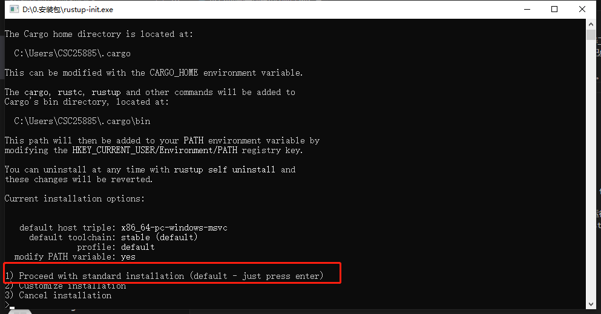
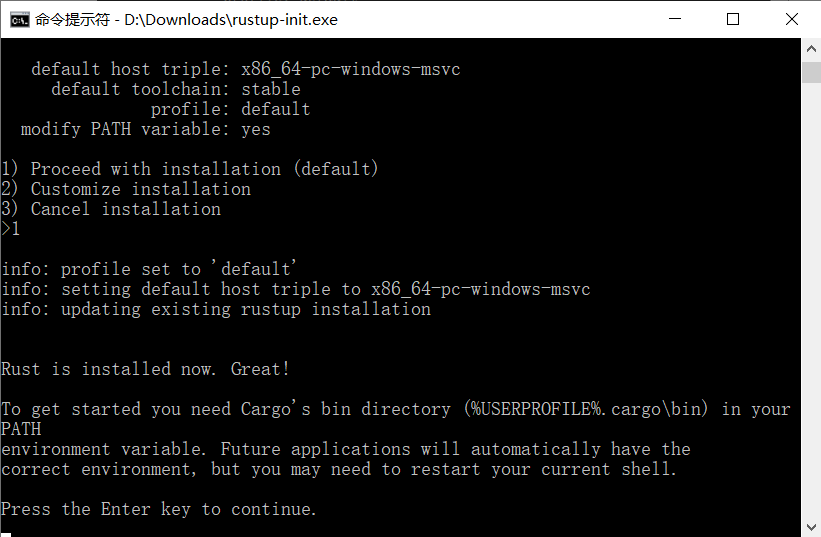

安装完成后使用rustc -V  、 cargo -V测试是否安装成功
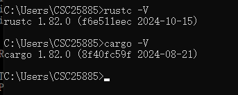

在完成以上步骤后使用VSCode进行项目编译运行时仍然有可能报错，在安装VS时未将Rust依赖的环境安装到最新，可在终端中执行以下命令来手动更新最新版本gnu
rustup default stable-x86_64-pc-windows-gnu
## 下载VSCode安装常用插件
登录 vsCode官网 https://code.visualstudio.com/ 下载安装
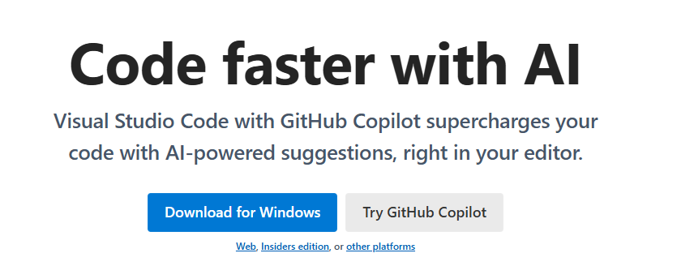
安装完成后根据网上推荐，安装以下插件。以下是这些插件的介绍

(1) Rust
Rust: 是官方维护的rls（rust语言服务器）2.0版本，已有VSCode插件。

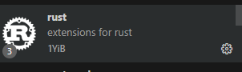

(2) rust-analyzer
rust-analyzer：它会实时编译和分析你的 Rust 代码，提示代码中的错误，并对类型进行标注。你也可以使用官方的 rust 插件取代。
一般我们都会安装官方的。但我用了后，发现官方的有些功能缺失，比如没法在 VSCode 中直接运行 Rust。于是我换成社区的，发现可以。查了一些资料，目前看社区版本确实比官方的好。因此目前建议大家安装社区版的 rust-analyzer。该插件的完整手册地址：https://rust-analyzer.github.io/manual.html。

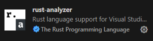

(3)rust syntax
为代码提供语法高亮。

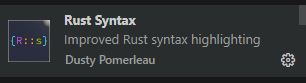

(4) crates 
帮助你分析当前项目的依赖是否是最新的版本。

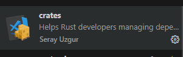

(5)better toml
Rust 使用 toml 做项目的配置管理。

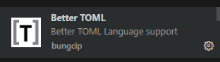

(6) rust test lens
可以帮你快速运行某个 Rust 测试。

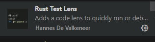

(7)Tabnine
基于 AI 的自动补全，可以帮助你更快地撰写代码。

一位来自加拿大的大四学霸，开发了一款”Deep TabNine“代码补全工具，实现了这一大胆的想法。
它支持23种编程语言、5种编辑器，使用简单，效果惊艳。
不少使用过的网友说：TabNine是他们用过的最好的代码补全工具，这是属于程序员的杀手级应用。

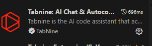
